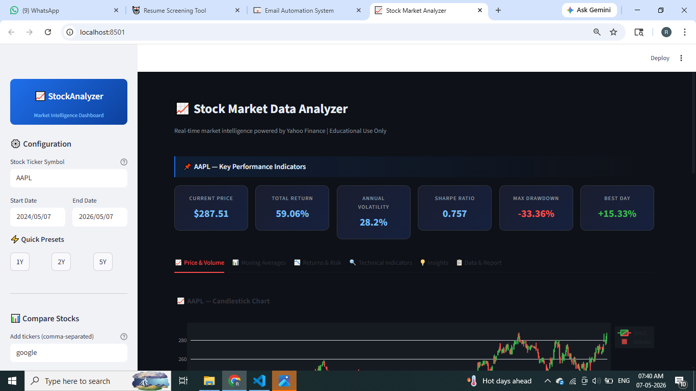
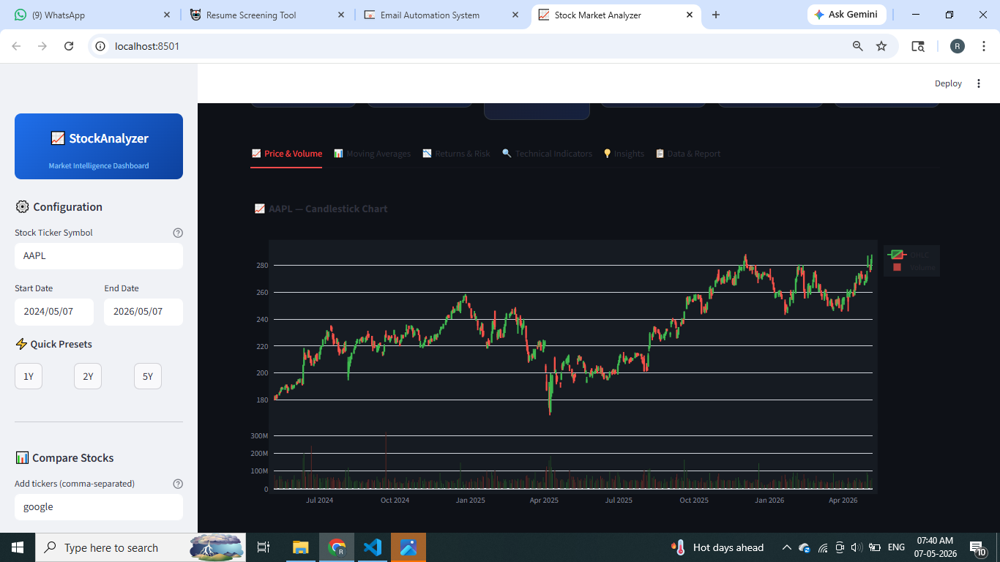
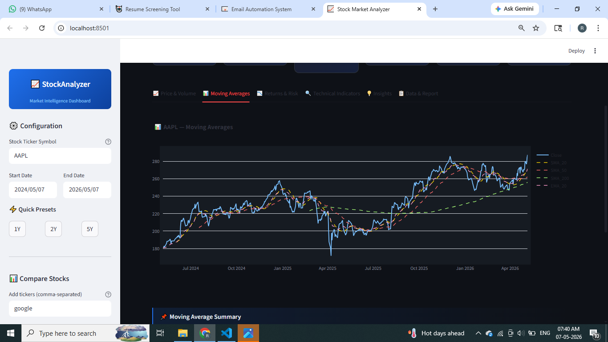
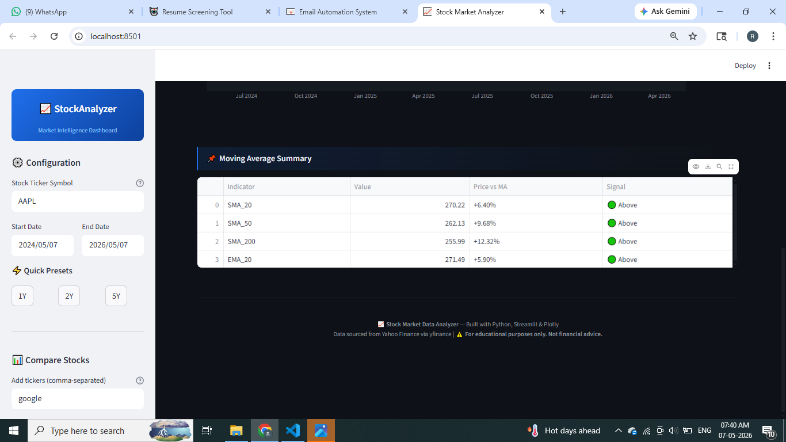
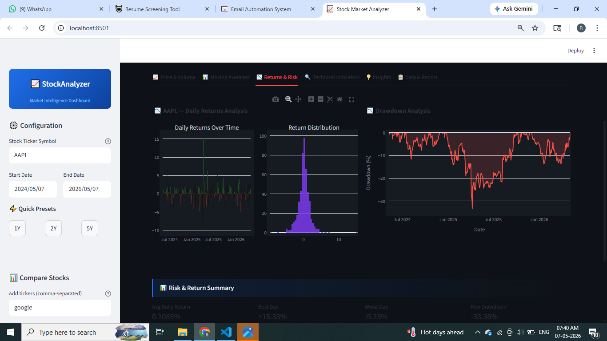
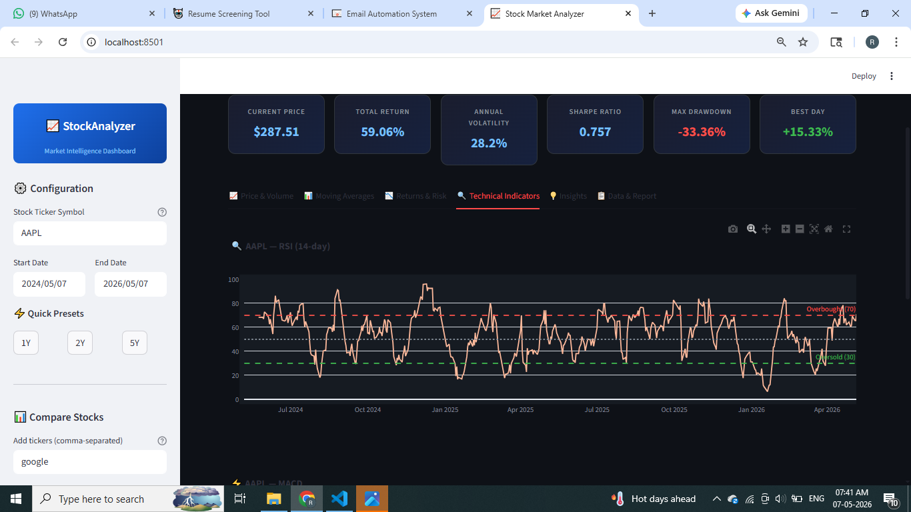
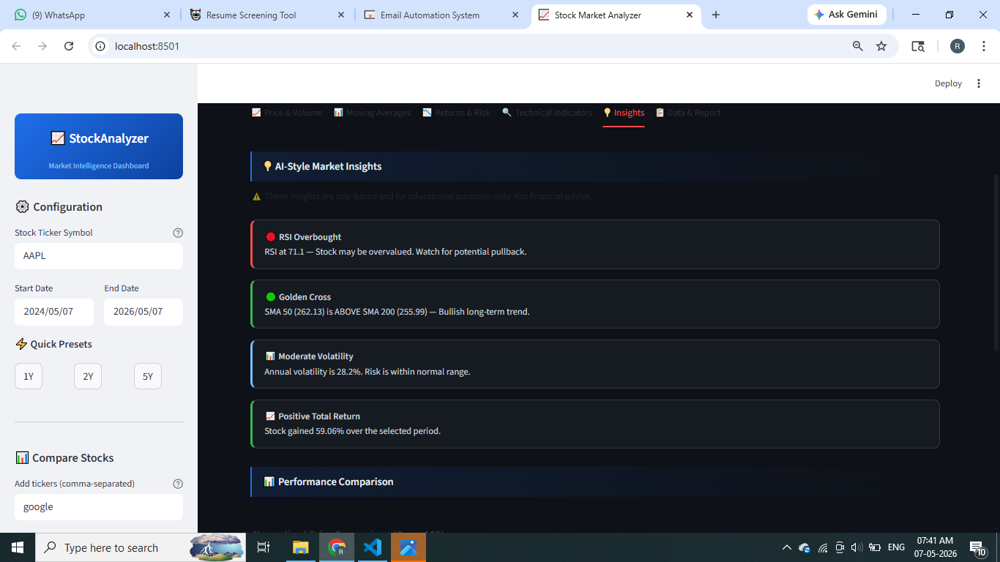
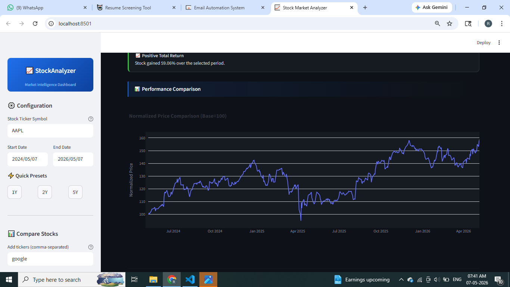
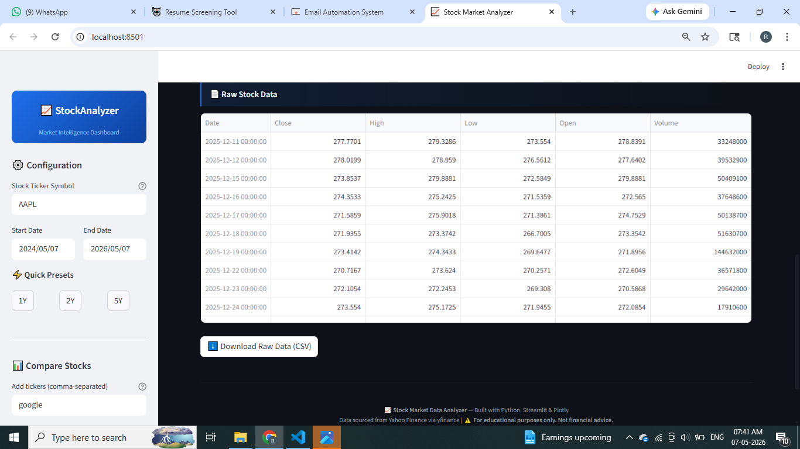

# 📈 Stock Market Data Analyzer

> **Educational Python project** demonstrating end-to-end stock market data 
> analysis using real public financial data.

---

## 🧩 Problem Statement
Financial analysts spend hours manually collecting and analyzing stock data.
This project automates the full pipeline — from data collection to insight
generation — using Python and free public APIs.

## 🏭 Industry Relevance
Used in: Investment Banking, FinTech, Asset Management, Robo-Advisory,
Algorithmic Trading, Financial Research

## ✨ Features
- 📥 Real-time data via Yahoo Finance (yfinance)
- 🧹 Automated data cleaning pipeline
- 📊 SMA 20/50/200, EMA 20 moving averages
- 🔍 RSI (14-day) overbought/oversold signals
- ⚡ MACD momentum indicator
- 🎯 Bollinger Bands
- 📉 Daily returns & return distribution
- 💰 Sharpe Ratio, Max Drawdown, Volatility
- 📈 Normalized multi-stock comparison
- 💡 Rule-based market insights
- ⬇️ One-click CSV report download
- 🌙 Dark-themed interactive Streamlit dashboard

## 🛠️ Tech Stack
| Library | Purpose |
|---------|---------|
| yfinance | Stock data fetching |
| pandas | Data processing |
| numpy | Mathematical computation |
| plotly | Interactive charts |
| streamlit | Web dashboard |
| fpdf2 | PDF report generation |

## 📁 Folder Structure
Stock-Market-Data-Analyzer/
├── data/           ← Cached CSV files
├── src/            ← Core Python modules
├── outputs/        ← Generated charts
├── reports/        ← Analysis reports
├── app.py          ← Streamlit dashboard
├── main.py         ← CLI entry point
└── requirements.txt

--

## 🚀 How to Run
bash
pip install -r requirements.txt
streamlit run app.py

--

## 📸 Sample Output
Candlestick + Volume chart
Moving average crossover signals
RSI + MACD technical indicators
Drawdown analysis
Complete risk/return report

--

## 🎓 Learning Outcomes

Real-world financial data analysis
Technical indicator implementation
Interactive dashboard development
Python modular project structure
GitHub portfolio building

--

## ⚠️ Disclaimer
This project is for educational purposes only and does not constitute
financial advice. Past performance does not guarantee future results.
Always consult a certified financial advisor before making investment decisions.

--

## 1️⃣2️⃣ PROOF BUILDING STRATEGY

| Day | Task | Commit Message | Screenshot |
|-----|------|---------------|------------|
| Day 1 | Setup venv, install libs, create folder structure | `chore: project setup and folder structure` | Folder tree in VS Code |
| Day 2 | Write data_fetcher.py, test with AAPL | `feat: stock data fetching with yfinance` | Terminal showing data download |
| Day 3 | Write data_cleaner.py + EDA in Jupyter | `feat: data cleaning and exploratory analysis` | Jupyter notebook with df.describe() |
| Day 4 | Write analyzer.py (SMA, RSI, Sharpe) | `feat: moving averages and risk metrics` | Terminal showing metric summary |
| Day 5 | Write visualizer.py, generate all charts | `feat: interactive Plotly visualizations` | Chart screenshots |
| Day 6 | Complete app.py Streamlit + README + push | `feat: Streamlit dashboard + project documentation` | Dashboard in browser |

---

## 1️⃣3️⃣ SCREENSHOTS 

---

## 🎬 Demo Video
[▶️ Watch Demo ](https://drive.google.com/file/d/1HT9laEv1cSAru3rHKxD8hR2YJmbWGSfD/view?usp=drive_link)

--

## 📦 Datasets

No manual download needed — `yfinance` fetches live data automatically.

**For CSV fallback testing (free datasets):**
- **Kaggle:** [S&P 500 Stocks dataset](https://www.kaggle.com/datasets/camnugent/sandp500)
- **Yahoo Finance manual export:** finance.yahoo.com → any stock → Historical Data → Download
- **NSE India:** nseindia.com → historical data (for Indian stocks)

Place any downloaded CSV in the `/data` folder. The fetcher will use it automatically if the file matches the naming pattern `data/TICKER_START_END.csv`.

---

> ⚠️ **Disclaimer:** This project is built entirely for educational and portfolio purposes. It does not constitute financial advice. Always consult a certified financial advisor before making investment decisions.
